# Creatures

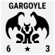 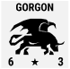 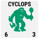 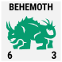 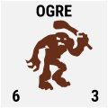 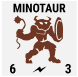 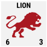 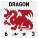 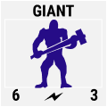 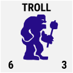 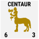 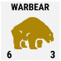 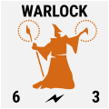 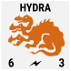 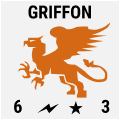 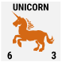 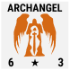 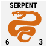 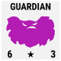 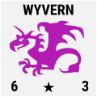 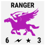 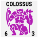  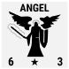

## creature details

| code | name      | count | str  | int  | skill |
| ---- | --------- | ----- | ---- | ---- | ----- |
| a    | Angel     | 18    | 6    | 4    | Fly   |
| b    | Archangel | 6     | 6    | 4    | Fly   |
| c    | Behemoth  | 18    | 6    | 4    |       |
| d    | Centaur   | 25    | 6    | 4    |       |
| e    | Coloss    | 10    | 6    | 4    |       |
| f    | Cyclop    | 28    | 6    | 4    |       |
| g    | Dragon    | 18    | 6    | 4    | Fly   |
| h    | Gargoyle  | 21    | 6    | 4    | Fly   |
| i    | Giant     | 18    | 6    | 4    | Range |
| j    | Gorgon    | 25    | 6    | 4    | Range |
| k    | Griffon   | 18    | 6    | 4    | Both  |
| l    | Guardian  | 6     | 6    | 4    | Range |
| m    | Hydra     | 10    | 6    | 4    | Range |
| n    | Lion      | 28    | 6    | 4    |       |
| o    | Minotaur  | 21    | 6    | 4    | Range |
| p    | Ogre      | 25    | 6    | 4    |       |
| q    | Ranger    | 28    | 6    | 4    | Both  |
| r    | Serpent   | 10    | 6    | 4    |       |
| s    | Titan     | 6     | 6    | 4    |       |
| t    | Troll     | 28    | 6    | 4    |       |
| u    | Unicorn   | 12    | 6    | 4    |       |
| v    | Warbear   | 21    | 6    | 4    |       |
| w    | Warlock   | 6     | 6    | 4    |       |
| x    | Wyvern    | 18    | 6    | 4    | Fly   |

* **Range** = Range Strike, **Both** = Fly & Range Strike

