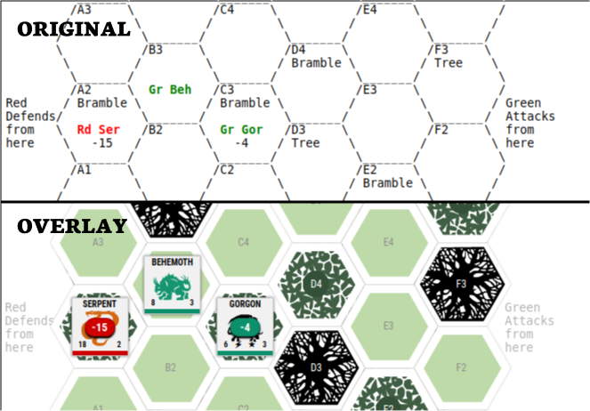
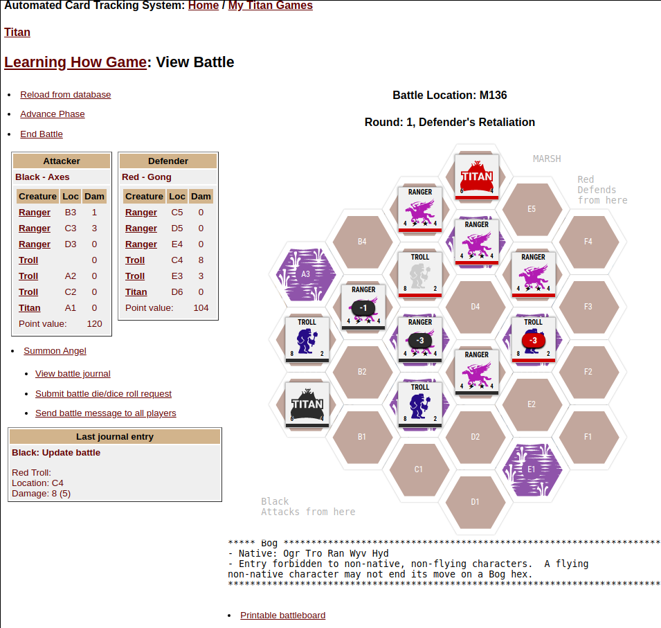
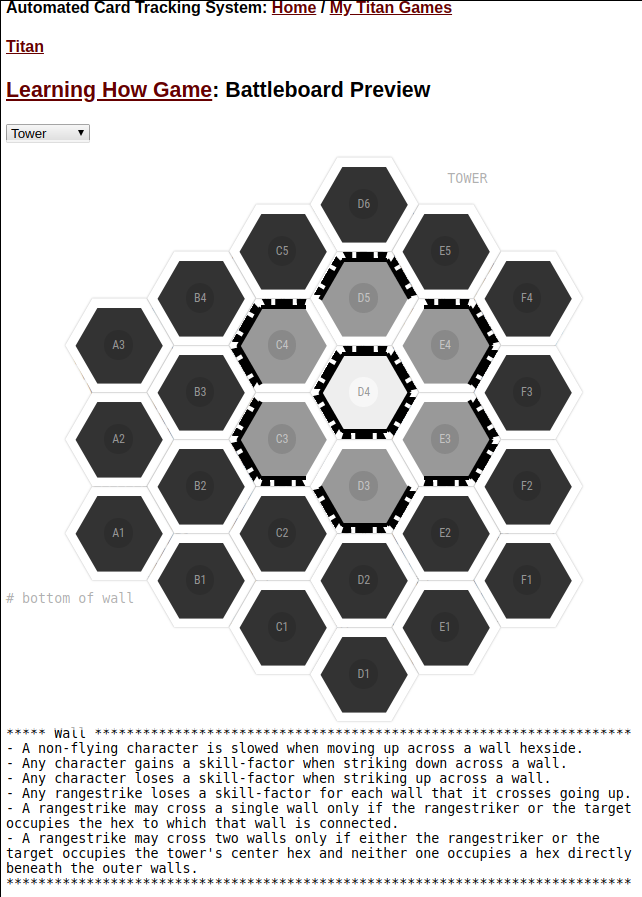

# Chrome extension for ACTS

A proof of concept project that injects a graphical overlay into the DOM to improve UX.

## What is ACTS?

Automated Card Tracking System (ACTS) it is a free service offered by [WARHORSE SIMULATIONS](http://www.warhorsesim.com/). In summary it's a website that lets people play board games online, and tracks the progression of the respective games. I discovered the website while researching TITAN implementations, of which ACTS is the easiest to access and [Colossus](http://colossus.sourceforge.net/) is the most faithful implementation, and includes various different game extensions.

There are also these: [TitanHD](https://apps.apple.com/gb/app/titan-hd/id488026817) (iPad App ~ I don't own an Apple devices to check it out), and [TitanHD](https://play.google.com/store/apps/details?id=ca.valleygames.titan&hl=en) (Android), which I'm currently evaluating (on ChromeOS). The latter is well done, but the redesign is not quiet the TITAN that I fell in love with.

*One thing worth mentioning about Android App running on ChromeOS, it works IF your device has a touch screen, mine does, but I did notice that the mouse clicks are not captured, nevertheless it definitely works fine.*

## Why the extension?

For a while I have wanted a project where I could un-intrusively improve the user interface by leveraging the Google Chrome Extension API. ACTs is an legacy system, that uses ASCII art to render the mainboard and battlelands. To me that is an absolutely ideal candidate. I played TITAN a lot in my youth, and missed the graphical charm of the game in their functional UI.

The extension hooks onto the DOM, (specifically in the Battlelands) after the page has rendered and then parses the ASCII art into a JSON schema, which is used to overlay pretty pictures and capture a click event on the injected DOM objects. It leaves original DOM intact. It's an overlay, no more, no less. And that is all it does. Nothing nefarious :D

## Screen shots

### View Battle

A battle occurring in the marsh depicting TITAN and creature color (same as player's color), and creature health, the gray TROLL, is ... fifty shades of dead, and the damage marker is the same as the existing ACTS notation. 

### Battleboard Preview

You can see all of the graphical overlays by cycling through the respective boards on the Battleboard preview page, here is the TOWER terrain.

I would love to explore more complex interactions, but only if got the site owners blessing :D

If you played TITAN back in the day, and miss the stunning graphics of the game, then this is for you. I guess it is a love-letter to the now deceased [David A Trampier](https://en.wikipedia.org/wiki/David_A._Trampier) and Jason McAllister, the creators of the original Avalon Hill masterpiece ... RIP

# Privacy Policy and MIT Licence

In compliance with the required Developer Program Policies of the Google Web Store, I hereby declare that; this extension does not use any form of usage analytics, data tracking, setting of cookies or data harvesting in any form whatsoever. The author is not affiliated with Warhorse Simulations or their Automated Card Tracking System (ACTS) service in any way.

This product is a free and open source project, for the betterment of the community for which it was created, and governed by the MIT License. The source code is available on Github for public scrutiny.

https://github.com/fliptopbox/titan/
